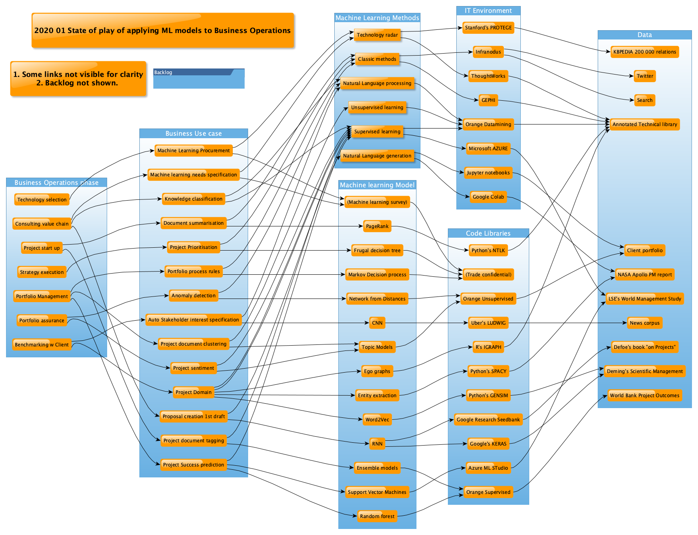

# Machine-learning-for-project-portfolios

# Purpose

- Apply machine learning to understand how to improve the project portfolio

- Taking portfolio data and applying ML for insight.

# Introduction

There is a full description [here](https://lawrencerowland.github.io/ML-for-portfolios.html), suggesting different ways of approaching the topic. 

If you have reasonable data on your projects or work-packages, then the example below gives a prototype for making a forecast with your own data, after making adjustments to reflect the particular project attributes you have recorded. 

Further below is a summary of the business rationale for the example

# Or straight to code and examples
But if you want to go straight to details , then here are the folder choices:

1. [Project success Prediction](https://github.com/lawrencerowland/Machine-learning-for-project-portfolios/tree/master/project-success-prediction)

1. [Natural language processing for assessing your project domain using Orange](https://github.com/lawrencerowland/Data-Model-for-Project-Frameworks/tree/master/Project-frameworks-by-using-NLP-in-Orange-Datamining)

1. [Natural language processing for assessing your project domain using Gensim and other Python libraries](https://github.com/lawrencerowland/Data-Model-for-Project-Frameworks/tree/master/Project-frameworks-by-using-NLP-with-Python-libraries)

# Example: Project Success Prediction on 12,000 projects

## What task/decision are you examining?

We are examining the way that a portfolio of projects is overseen by a large Institution. We have started with the World Bank as they have data on 12000 projects and which were ultimately successful. The decision we are seeking to improve is in identifying which projects are unlikely to succeed, and whether they should be cancelled, re-scoped, supported, or monitored as a result. This task can be selectively generalised to Client portfolios depending on the completeness of data and the type of features captured. 

## Prediction:

Predict during project implementation which World Bank projects will be evaluated as Satisfactory after the project completes. 

## Judgement:

The payoffs of being right for the Institution are being able to focus on shutting or intervening in projects that are likely to fail. The impact of false positives is cancelling projects that might otherwise be successful. The impact of false negatives is less serious as it would just lessen the improvement in project coverage

## Action:

The actions that can be chosen as a result of the judgement would be to:
1. Review a project forecast to fail
2. Strengthen resource on these projects

## Outcomes:

We would judge whether we are achieving our outcomes by monitoring whether Projects forecast to succeed actually do succeed. For the WB and this dataset, since accuracy achieved is 90%, this should be the target during production. 
What % projects forecast to fail do fail – anything over 50% would be good

## Training:

To do this we used a sample of the 12000 previous projects. Each project has been rated as Satisfactory, or Unsatisfactory, Highly Satisfactory etc. after the project concluded by the client. This rating label  has been used as the target for Learning. Each project has about 20 features recorded for it, and our model is trained to understand which combinations of these features are most predictive of success. This is a supervised learning approach, where we have ended up training and selecting a Random Forest Model as providing the best results. 

## Input:

Now that we have trained the model, we would need data on currently running projects as per the feature list used in training. These include forecast to completion, mid-project quality reviews and industry area. This could be fed into the model once a month by the portfolio manager. 

## Feedback:

During production, we will need to use measured outcomes along with input data to generate improvements to our predictive algorithm. This can be done semi-annually, re-running and refitting the whole model. A new model would then need to be issued to the portfolio manager.  

## How will this AI impact on the overall workflow?

Regularly predicting project success will focus management attention on the right projects. It will improve forecasting accuracy, and thereby should increase overall project completion. It may also have a lesser effect on early project scoping and project selection. The impact on the portfolio manager would be a day a month. Since there are likely to be project reviews and interventions for failing projects already, it is likely that the time taken on these from model predictions would be substitution of existing tasks rather than new tasks. As this is implemented, there would be a backlog effect and a higher turnover and reallocation of project teams. 

## To run this example or modify for your portfolio...

[Project success Prediction](https://github.com/lawrencerowland/Machine-learning-for-project-portfolios/tree/master/project-success-prediction)

# Alternative: Use AutoML on Microsoft Azure

If your team already works in a Microsoft environment, with Office, Azure and Power BI, then it is worth taking advantage of the AutoML capabilities. 

This allows data and results to remain within one environment. AutoML will find the best fit it can, selecting the most appropriate model. 

This can also be useful as a 'ranging shot', seeing if your data can support a useful prediction. Then, it can be useful to work on your own model, whether in Orange Data Mining, or in Python with SciKitLearn or Keras. I find follow up step helps in understanding what the model is doing, and gives more appreciation for understanding how to improve the data-set. 
AutoML is very useful, but it still using SciKitLearn under the hood. 

There are also useful low-code approaches with Azure. The examples below regarding preliminary data exploration on the interesting [World Management Survey](https://worldmanagementsurvey.org) dataset, which looks at what management features are associated with success. Please raise an issue if you would like me to prioritise writing up this example. 

# Notes

Currently the approaches are conventional ML applied to project data from spreadsheets and relational databases. For ML applied to project data taken from graph databases,see (xx)[xx]

# Overview of other examples
Please raise an issue if you want any more of these uploaded - I haven't got around to it yet. 
 

# Acknowledgements

- Modelling Using Orange Data mining. 

- Data from World Bank.

- Questions from using AI canvas Template © Agrawal, Gans, Goldfarb 2019. 

